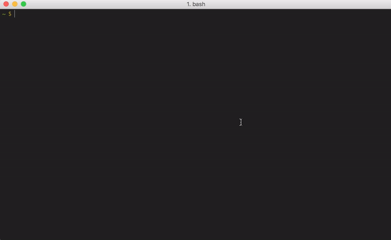
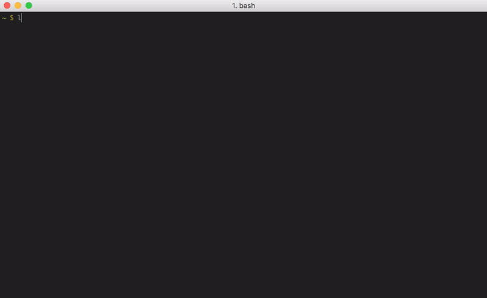

# Welcome to lyrics-dl

### lyrics-dl is a tool that finds the lyrics to your favorite songs

### Features :-
* Enter any artist and song name when prompted and lyrics will be printed to standard output
* Give an mp3 file as an attribute, and find lyrics using the mp3's metadata
* Save the obtained lyrics into the mp3's metadata

Support for other formats coming soon!
### Installation :-
* Via pip : `pip install lyrics-dl`

##### Alternatively
1. Clone the repo
2. Enter the downloaded repo's root directory : `cd lyrics-dl`
3. Install the required modules and its dependencies by running `pip install -r requirements.txt` (You may want to consider using a virtual environment)
4. Install lyrics-dl by running `pip install .` or `python setup.py install`

### Usage :-
* Type `lyrics-dl` to receive prompt for artist and song name
* Type `lyrics-dl <filenames>` to obtain lyrics for mp3 files

### Demo :-
1. By Entering artist and song information yourself :-

 

2. By providing an mp3 file as an argument :-
###### Note : You can use wildcards to find lyrics for many files at once. This is one of lyrics-dl's most useful features 
###### (Ex : `lyrics-dl *.mp3`)

##### The -s option saves the obtained lyrics in the mp3's metadata, allowing you to view it later on some media players
##### One such media player is iTunes, which is shown below :-

 

###### Note : Check lyrics-dl --help for in-depth instructions
